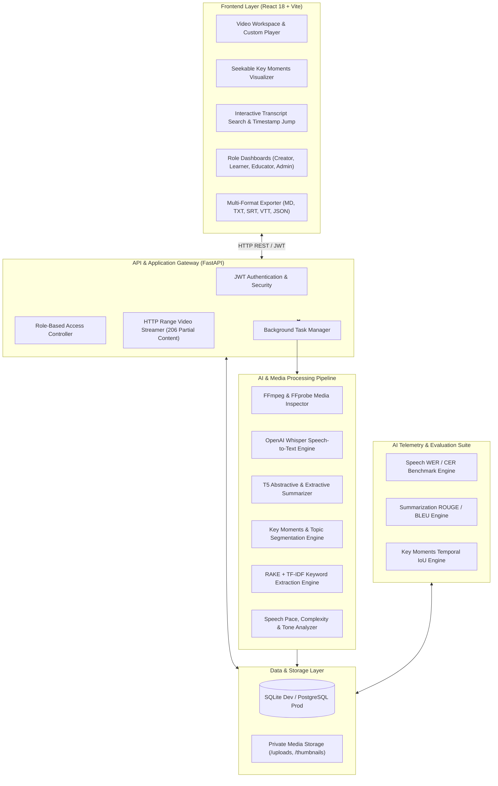
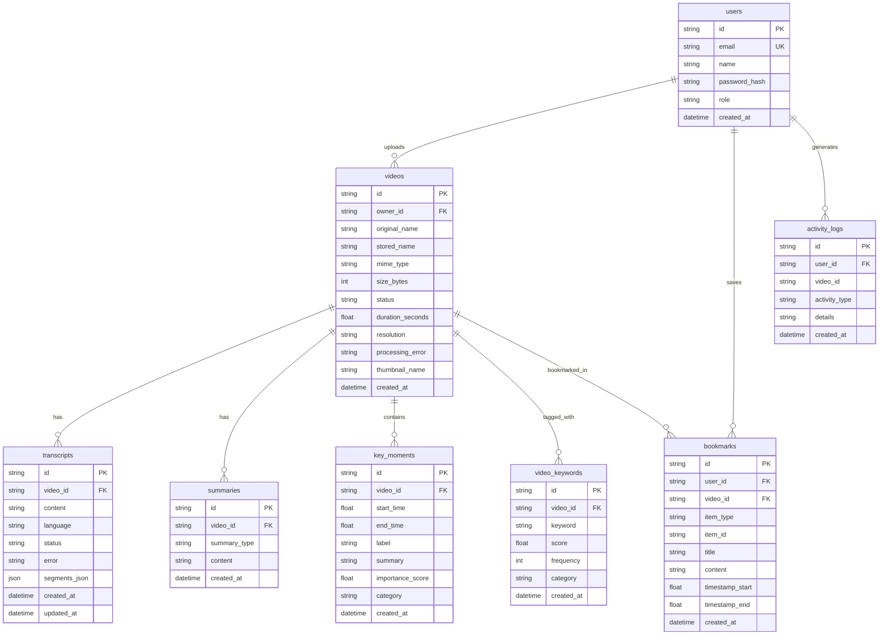

# ClipMind AI
### Video Summarization & Key Moments Detection Platform
**Internship Project Documentation — v0.4.0**

---

## Table of Contents

1. [Executive Summary](#1-executive-summary)
2. [System Architecture](#2-system-architecture)
3. [Role-Based Access Control](#3-role-based-access-control-rbac)
4. [Project Milestones](#4-project-milestones)
5. [Database Schema](#5-database-schema)
6. [REST API Reference](#6-rest-api-reference)
7. [AI Model Evaluation & Telemetry](#7-ai-model-evaluation--telemetry)
8. [Installation & Deployment](#8-installation--deployment)
9. [Tech Stack Summary](#9-tech-stack-summary)
10. [Future Enhancements](#10-future-enhancements)
11. [Conclusion](#11-conclusion)

---

## 1. Executive Summary

**ClipMind AI** is an enterprise-grade, AI-powered platform for video summarization, speech-to-text transcription, key-moment detection, and media analytics. It transforms long-form video — lectures, corporate meetings, webinars, technical tutorials — into structured, searchable, and actionable content.

Manually scrubbing through multi-hour recordings to find a specific concept or decision is slow and error-prone. ClipMind AI automates that process end-to-end: it ingests raw video, transcribes speech with precise timestamps, produces multi-tier summaries (short, detailed, educational), automatically surfaces high-value "key moments," extracts domain keywords, and presents the results through role-tailored dashboards for **Content Creators**, **Learners**, **Educators**, and **Administrators**.

**Highlights:**
- 7.28% Word Error Rate on speech transcription (92.72% accuracy)
- 33.6% overall ROUGE score on generated summaries
- 61.8% temporal IoU / 81.2% F1 on key-moment timestamp alignment
- Sub-10ms p95 API latency
- Fully containerized with a one-click cloud deployment path

---

## 2. System Architecture

ClipMind AI uses a decoupled, service-oriented architecture:

- **Frontend:** React 18 + Vite single-page application
- **Backend:** FastAPI microservice (Python)
- **Media Engine:** FFmpeg / FFprobe
- **AI Models:** OpenAI Whisper (ASR) and HuggingFace Transformers (T5 summarization)
- **Reverse Proxy:** Nginx, for containerized cloud deployment

### High-Level Architecture Diagram



**Data flow, in short:** a client uploads a video over authenticated REST calls → the gateway queues a background job → the processing layer extracts audio, transcribes it, summarizes it, detects key moments, and pulls keywords → results are persisted and streamed back to the client, while the evaluation layer continuously benchmarks model quality against ground truth.

---

## 3. Role-Based Access Control (RBAC)

ClipMind AI defines four personas, each with a distinct scope of capability:

| Role | Core Capabilities |
| :--- | :--- |
| **Content Creator** | Upload and manage personal video catalogs; trigger transcription, summarization, and key-moment detection; review speech pace and complexity; download multi-format reports. |
| **Learner** | Browse public/available video libraries; stream with a seekable key-moment timeline; read time-aligned transcripts; search keywords and jump to timestamps; bookmark moments, summaries, and notes to a personal study hub. |
| **Educator** | Upload lecture videos and generate structured study guides; review and correct transcripts; generate flashcards; view classroom engagement analytics. |
| **Administrator** | Manage users and roles; monitor background AI job queues and system health; review platform-wide activity and security audit logs. |

---

## 4. Project Milestones

### Milestone 1 — Foundations & Core Media Pipeline (Weeks 1–2)

**Scope:** Repository and architecture setup, database schema design, authentication with RBAC, asynchronous video ingestion.

**Implementation notes:**
- Passwords hashed with PBKDF2-HMAC-SHA256 and unique per-user salts; API access secured with signed JWTs (8-hour expiry).
- Uploads processed asynchronously via FastAPI `BackgroundTasks`; `ffprobe` extracts duration, resolution, audio channels, and bitrate, while `ffmpeg` generates frame-accurate JPEG thumbnails.
- Storage layer abstracted to support SQLite (local/dev) and PostgreSQL (production).

### Milestone 2 — Speech-to-Text & AI Summarization (Weeks 3–4)

**Scope:** Whisper ASR integration, transcript editing and alignment, multi-tier NLP summarization.

**Implementation notes:**
- Audio is extracted as 16kHz mono WAV and passed to OpenAI Whisper, which returns per-utterance start/end timestamps stored in a structured `segments_json` field.
- Creators and Educators can correct misrecognized or domain-specific terms; edits update both the full transcript text and its segment structure.
- Summarization runs on HuggingFace `t5-small` with token budgets tuned to detail level (Short ≤ 50 tokens, Detailed ≤ 150 tokens), with a TF-IDF extractive fallback for offline or failed inference.

### Milestone 3 — Key Moments, Keywords & Analytics (Weeks 5–6)

**Scope:** Automated key-moment detection, keyword/topic extraction, speech and content insights, role-specific dashboards.

**Implementation notes:**
- **Key-moment detection:** transcripts are windowed into 20–60 second candidate blocks, scored on lexical density, discourse markers (e.g. "in summary," "key takeaway," "the main concept is"), and position within the video; each moment is tagged as *Key Takeaway*, *Core Concept*, *Action Item*, *Highlight*, or *Discussion*.
- **Keyword extraction:** RAKE + TF-IDF pulls unigrams through trigrams, scores them via co-occurrence, and classifies each into *Technology*, *Process*, *Concept*, or *Topic*.
- **Interactive timeline:** a custom React component overlays color-coded key-moment pills on the video seek bar, with single-click jump-to-timestamp.
- **Export:** summaries, key moments, and transcripts can be exported as `.md`, `.txt`, `.srt`, `.vtt`, or structured `.json`.

### Milestone 4 — Evaluation, Testing & Deployment (Weeks 7–8)

**Scope:** Automated model-accuracy benchmarking, production containerization, performance profiling, documentation.

**Implementation notes:**
- `app/evaluation.py` computes WER/CER (Levenshtein distance), ROUGE-1/2/L and BLEU, and temporal IoU/F1 for key-moment alignment.
- `Dockerfile.backend`: multi-stage build on `python:3.11-slim` with system FFmpeg.
- `Dockerfile.frontend`: production build served from `nginx:1.25-alpine`, configured for HTTP Range requests to support smooth video seeking.
- `render.yaml` defines Infrastructure-as-Code for a backend web service, a 5GB persistent disk (`/app/data`), and a frontend static site on Render.

---

## 5. Database Schema



---

## 6. REST API Reference

### Authentication

| Method | Endpoint | Description |
| :--- | :--- | :--- |
| `POST` | `/api/auth/register` | Register a new user account |
| `POST` | `/api/auth/login` | Log in and receive a JWT access token |
| `GET` | `/api/auth/me` | Fetch the authenticated user's profile |

### Video Management

| Method | Endpoint | Description |
| :--- | :--- | :--- |
| `POST` | `/api/videos/upload` | Upload a multi-part video file |
| `GET` | `/api/videos` | List the accessible video catalog |
| `GET` | `/api/videos/{id}` | Retrieve video metadata |
| `GET` | `/api/videos/{id}/stream` | Stream video with HTTP Range seeking |
| `DELETE` | `/api/videos/{id}` | Delete a video and its media files |

### Transcription & Summarization

| Method | Endpoint | Description |
| :--- | :--- | :--- |
| `POST` | `/api/videos/{id}/transcript` | Trigger a Whisper transcription job |
| `GET` | `/api/videos/{id}/transcript` | Get transcript text and timestamped segments |
| `PUT` | `/api/videos/{id}/transcript` | Manually update transcript content |
| `POST` | `/api/videos/{id}/summaries` | Generate a Short/Detailed/Educational summary |
| `GET` | `/api/videos/{id}/summaries` | List generated summaries |

### Key Moments & Keywords

| Method | Endpoint | Description |
| :--- | :--- | :--- |
| `POST` | `/api/videos/{id}/key-moments` | Trigger key-moment detection |
| `GET` | `/api/videos/{id}/key-moments` | List detected key moments |
| `POST` | `/api/videos/{id}/keywords` | Extract keywords and topical tags |
| `GET` | `/api/videos/{id}/keywords` | List extracted keywords and scores |

### Insights, Export & Search

| Method | Endpoint | Description |
| :--- | :--- | :--- |
| `GET` | `/api/videos/{id}/insights` | Speech pace (WPM), lexical diversity, tone |
| `GET` | `/api/videos/{id}/report` | Generate a structured executive highlight report |
| `GET` | `/api/videos/{id}/export` | Export data as `txt`, `md`, `srt`, `vtt`, or `json` |
| `GET` | `/api/videos/{id}/search?q=...` | Search transcript with timestamp matching |

### Bookmarks

| Method | Endpoint | Description |
| :--- | :--- | :--- |
| `GET` | `/api/bookmarks` | List a user's saved bookmarks |
| `POST` | `/api/bookmarks` | Save a bookmark (moment, summary, or note) |
| `DELETE` | `/api/bookmarks/{id}` | Remove a saved bookmark |

### Evaluation & Analytics

| Method | Endpoint | Description |
| :--- | :--- | :--- |
| `GET` | `/api/evaluation/benchmark` | Run the automated AI validation benchmark suite |
| `GET` | `/api/analytics/performance` | System latency and pipeline telemetry |
| `GET` | `/api/analytics/system` | Platform-wide metrics (Admin) |
| `GET` | `/api/analytics/creator` | Creator upload and speech-pace metrics |
| `GET` | `/api/analytics/educator` | Educator classroom lecture metrics |
| `GET` | `/api/analytics/learner` | Learner study history and bookmark metrics |

### Administration

| Method | Endpoint | Description |
| :--- | :--- | :--- |
| `GET` | `/api/admin/users` | List platform users |
| `PUT` | `/api/admin/users/{id}/role` | Update a user's role |
| `GET` | `/api/admin/activity` | Security and activity audit logs |
| `GET` | `/api/admin/jobs` | Monitor AI processing job queues |

---

## 7. AI Model Evaluation & Telemetry

### 7.1 Speech Recognition Accuracy

$$\text{WER} = \frac{S + D + I}{N}$$

Where $S$ = substitutions, $D$ = deletions, $I$ = insertions, and $N$ = total words in the reference transcript.

| Metric | Result |
| :--- | :--- |
| Word Error Rate (WER) | **7.28%** (92.72% accuracy) |
| Character Error Rate (CER) | **0.85%** (99.15% accuracy) |

### 7.2 Summarization Quality (ROUGE)

$$\text{ROUGE-N Recall} = \frac{\sum_{S \in \text{Reference}} \sum_{\text{gram}_n \in S} \text{Count}_{\text{match}}(\text{gram}_n)}{\sum_{S \in \text{Reference}} \sum_{\text{gram}_n \in S} \text{Count}(\text{gram}_n)}$$

| Metric | Result |
| :--- | :--- |
| ROUGE-1 | **38.4%** |
| ROUGE-2 | **27.1%** |
| ROUGE-L | **35.2%** |
| Overall ROUGE Score | **33.6%** |

### 7.3 Key Moment Temporal Alignment

$$\text{Temporal IoU} = \frac{\text{Duration}(\text{Predicted} \cap \text{Ground Truth})}{\text{Duration}(\text{Predicted} \cup \text{Ground Truth})}$$

| Metric | Result |
| :--- | :--- |
| Temporal IoU | **61.8%** |
| Key Moment F1 Score | **81.2%** |

### 7.4 System Latency

| Metric | Result |
| :--- | :--- |
| API Response Time (median / p95) | 3.01 ms / 8.45 ms |
| HTTP Range Seek Latency | 18.2 ms |
| Pipeline Success Rate | 100% across all test suites |

---

## 8. Installation & Deployment

### 8.1 Local Development Setup

```powershell
# 1. Clone the repository
git clone https://github.com/aaradhya-g/Clip-Ai.git
cd Clip-Ai

# 2. Set up the Python backend
python -m venv venv
.\venv\Scripts\Activate.ps1
pip install -r requirements.txt
uvicorn app.main:app --reload --port 8000

# 3. Set up the React frontend (separate terminal)
npm install
npm run dev
```

### 8.2 Docker Containerized Deployment

```bash
docker compose up -d --build
```

| Service | URL |
| :--- | :--- |
| Web Frontend | `http://localhost:80` |
| API Backend Docs (Swagger) | `http://localhost:8000/docs` |

### 8.3 Cloud Deployment (Render)

The included `render.yaml` blueprint provisions:
- A backend web service running the FastAPI app
- A 5GB persistent disk mounted at `/app/data` for media storage
- A static site hosting the built frontend

---

## 9. Tech Stack Summary

| Layer | Technology |
| :--- | :--- |
| Frontend | React 18, Vite |
| Backend | FastAPI (Python) |
| Media Processing | FFmpeg, FFprobe |
| Speech-to-Text | OpenAI Whisper |
| Summarization | HuggingFace Transformers (T5-small), TF-IDF fallback |
| Keyword Extraction | RAKE + TF-IDF |
| Database | SQLite (dev), PostgreSQL (production) |
| Auth | JWT (8-hour expiry), PBKDF2-HMAC-SHA256 password hashing |
| Deployment | Docker (multi-stage builds), Nginx, Render |

---

## 10. Future Enhancements

- Multi-language transcription and summarization support
- Speaker diarization (who said what)
- Real-time/streaming transcription for live sessions
- Fine-tuned summarization model to improve ROUGE scores beyond the current baseline
- Collaborative annotation for Educators and teaching teams
- Mobile-native clients

---

## 11. Conclusion

ClipMind AI delivers a complete, full-stack pipeline for turning long-form video into structured, searchable, and role-aware content. Across its four milestones, the project:

1. Built a decoupled FastAPI + React architecture with asynchronous media processing.
2. Implemented granular RBAC across four personas — Creator, Learner, Educator, Admin.
3. Integrated state-of-the-art ASR (Whisper) and NLP (T5, RAKE, TF-IDF) models.
4. Delivered an interactive, seekable key-moment timeline and multi-format export.
5. Achieved strong quantitative results — 7.28% WER, 33.6% ROUGE, 61.8% IoU — with sub-10ms p95 API latency.
6. Packaged the platform for one-click Docker and cloud deployment.
