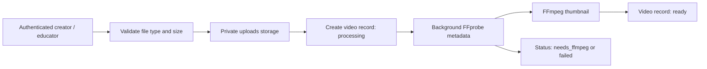
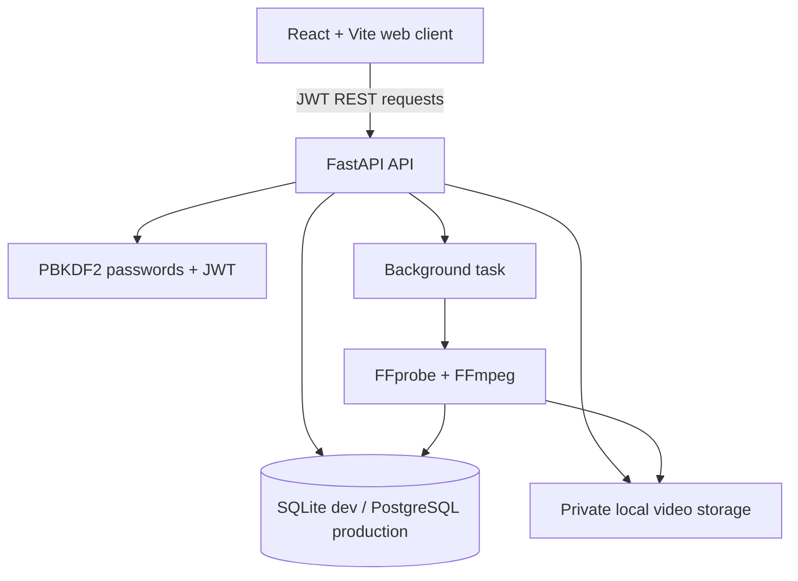
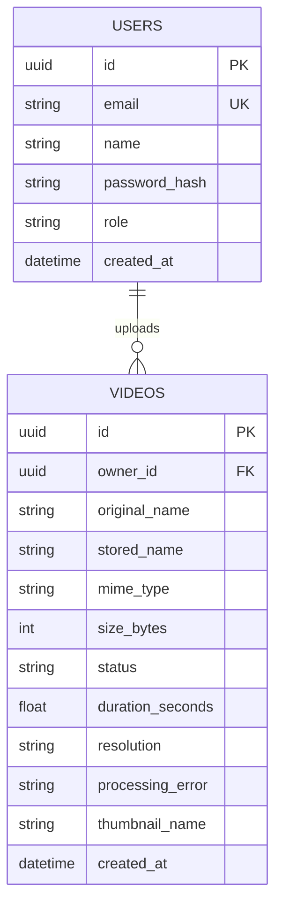

# ClipMind AI: Week 1-2 Design

## Scope boundary

This design covers initialization, media workflow planning, UI planning, environments, authentication/roles, video uploads, and FFmpeg processing only. It intentionally excludes Whisper, transcripts, summaries, key moments, analytics, Docker/cloud deployment, and testing for those modules.

## Objectives and media workflow

1. Give creators and educators a safe, role-controlled way to upload supported videos.
2. Preserve the original media and immutable upload metadata.
3. Immediately run lightweight FFmpeg inspection to establish duration/resolution and create a thumbnail.
4. Present clear progress and error status instead of blocking the upload request.



## System architecture



## Database schema



### Roles and access

| Role | Browse videos | Upload | Delete |
| --- | --- | --- | --- |
| Creator | Own uploads | Yes | Own uploads |
| Educator | Own uploads | Yes | Own uploads |
| Learner | All listed videos | No | No |
| Admin | All videos | Yes | Any video |

## UI wireframes

### Authentication

```text
+----------------------------------------------------+
| CLIPMIND AI / WEEK 1-2                             |
| Video workspace for the processing pipeline        |
|                                                    |
| [ Sign in ] [ Create account ]                     |
| Email     [____________________]                   |
| Password  [____________________]                   |
|                 [ Sign in ]                        |
+----------------------------------------------------+
```

### Workspace

```text
+----------------------------------------------------+
| ClipMind AI                         User / role    |
| Video workspace                                   |
|                                                    |
| Bring in a video              [ Choose ] [ Upload] |
| MP4, MOV, WebM, AVI, MKV                           |
|                                                    |
| Your uploads                     [ Refresh ]       |
| [▶] lecture.mp4    PROCESSING   54.2 MB  [Delete]  |
| [▶] intro.mov     READY        31.0 MB  [Delete]  |
+----------------------------------------------------+
```

## Environment decisions

- Development database: SQLite, for instant local startup.
- Production migration: point `DATABASE_URL` to PostgreSQL and replace the small repository adapter with an ORM/migration layer. The schema above is database-neutral.
- Storage: private local folders during development. Replace with an object-store adapter (such as S3/Azure Blob) before deployment.
- Security: passwords use PBKDF2-HMAC-SHA256 with unique random salts; access is a signed, 8-hour JWT. Change `JWT_SECRET` before sharing or deployment.
- Processing: FastAPI `BackgroundTasks` is appropriate for this first milestone. A persistent job queue is explicitly deferred to later deployment work.
