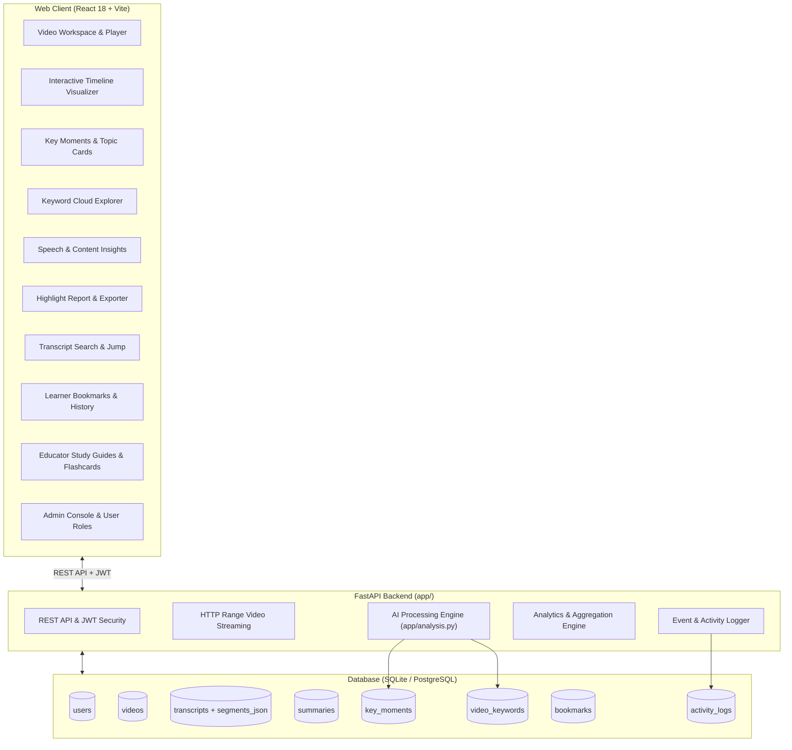
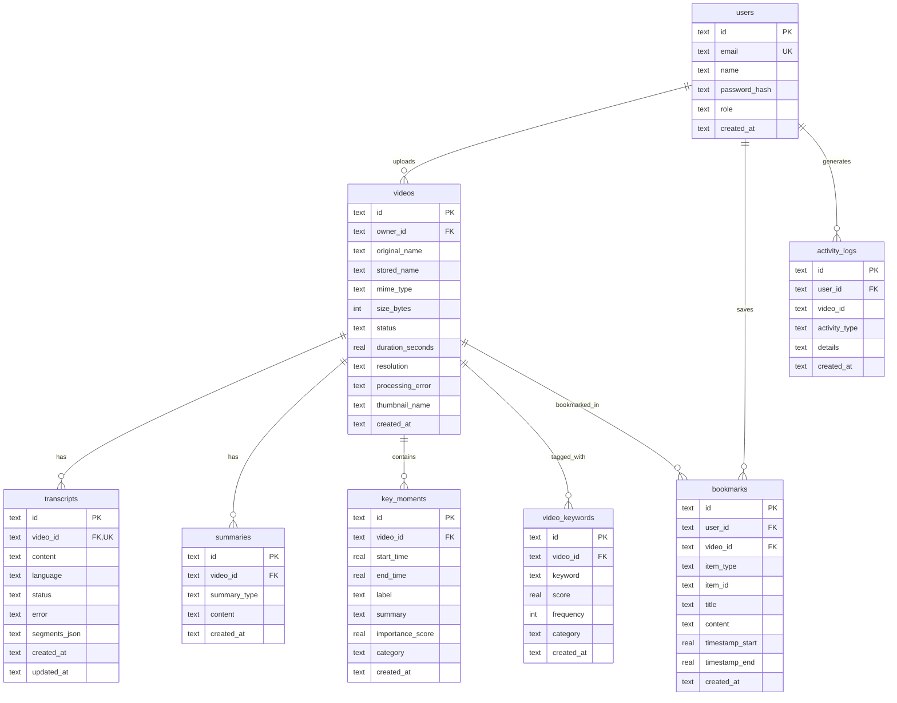

# ClipMind AI: Milestone 3 Design (Week 5 & 6)

## Scope & Objective

Milestone 3 implements the **Key Moments Detection & Analytics Dashboard** platform for ClipMind AI. Building on the core ingestion pipeline (Milestone 1) and Whisper transcription & summarization (Milestone 2), Milestone 3 provides deep video intelligence, topic and segment extraction, content insights, highlight reporting, role-specific analytics dashboards, and interactive learning workflows.

---

## 1. System Architecture

---

## 2. AI Processing & Analytical Algorithms

### 2.1 Timestamp Extraction & Alignment
- **Whisper Segments Integration**: When Whisper transcribes audio, exact start and end timestamps (`float` precision in seconds) for each speech segment are preserved and structured into `segments_json`.
- **Intelligent Fallback Segmentation**: For manual or external transcripts, text is parsed for explicit timestamp markers (e.g. `[01:23] ...`) or distributed proportionally across the video duration with sentence-boundary awareness.

### 2.2 Key Moments Detection Engine
1. **Windowing**: Group consecutive transcript segments into cohesive semantic candidate blocks (20–60 second windows or 2–4 sentences).
2. **Multi-Factor Scoring**:
   - **Lexical Salience**: TF-IDF weighting of informative content words excluding standard stopwords.
   - **Discourse Cues**: Pattern matching for high-value linguistic markers (e.g., *"the key takeaway"*, *"crucial to understand"*, *"in conclusion"*, *"first you need to"*, *"the core concept"*).
   - **Structural Position**: First segments prioritized as Core Concepts / Introductions; concluding segments weighted as Key Takeaways.
3. **Categorization**:
   - `key_takeaway`: Essential takeaways and conclusions.
   - `core_concept`: Foundational principles and architectural overviews.
   - `action_item`: Step-by-step procedures and implementation advice.
   - `highlight`: Notable facts, breakthroughs, and key observations.
   - `discussion`: Topic discussions and explanations.
4. **Summary & Labeling**: Automatic concise label generation and one-sentence synopsis per moment.

### 2.3 Keyword & Topic Extraction (RAKE + TF-IDF Hybrid)
- **Candidate Generation**: Extraction of informative unigrams, bigrams, and trigrams bounded by punctuation and stopwords.
- **Word Co-Occurrence Degree Matrix**: Evaluates lexical connectivity and word scores.
- **Categorization**: Auto-tagging into `technology`, `process`, `concept`, or `topic`.

### 2.4 Speech & Content Insights
- **Speaking Pace (WPM)**: Words per minute calculated against video duration with categorical assessment (*Deliberate*, *Optimal/Conversational*, *Fast/Dynamic*).
- **Lexical Diversity**: Type-Token Ratio (unique words / total words).
- **Complexity Rating**: Syntactic complexity and multi-syllable word ratio (*Foundational*, *Intermediate*, *Advanced/Technical*).
- **Sentiment & Tone Analysis**: Polarity and analytical framing (*Informative & Objective*, *Analytical & Technical*, *Positive & Inspiring*).

---

## 3. Database Schema

---

## 4. API Specification

| Method | Endpoint | Description |
| :--- | :--- | :--- |
| `POST` | `/api/videos/{id}/key-moments` | Trigger Key Moments detection |
| `GET` | `/api/videos/{id}/key-moments` | Retrieve detected key moments and timestamps |
| `POST` | `/api/videos/{id}/keywords` | Extract keywords and topical tags |
| `GET` | `/api/videos/{id}/keywords` | Get extracted keywords and relevance scores |
| `GET` | `/api/videos/{id}/insights` | Get speech pace, complexity, and sentiment insights |
| `GET` | `/api/videos/{id}/report` | Get structured highlight report (JSON) |
| `GET` | `/api/videos/{id}/export` | Export data (`format=txt\|md\|srt\|vtt\|json`) |
| `GET` | `/api/videos/{id}/search?q=...` | Search transcript with timestamp matching |
| `GET` | `/api/videos/{id}/stream` | Stream video file with HTTP Range support |
| `GET` | `/api/bookmarks` | List user bookmarks |
| `POST` | `/api/bookmarks` | Save a new bookmark |
| `DELETE`| `/api/bookmarks/{id}` | Delete bookmark |
| `GET` | `/api/analytics/system` | Platform-wide system analytics (Admin) |
| `GET` | `/api/analytics/creator` | Creator catalog and speech metrics |
| `GET` | `/api/analytics/educator` | Classroom lecture and engagement analytics |
| `GET` | `/api/analytics/learner` | Learning history and study metrics |
| `GET` | `/api/admin/users` | List all users (Admin) |
| `PUT` | `/api/admin/users/{id}/role` | Update user role (Admin) |
| `GET` | `/api/admin/activity` | System audit logs (Admin) |
| `GET` | `/api/admin/jobs` | Monitor AI processing jobs (Admin) |
